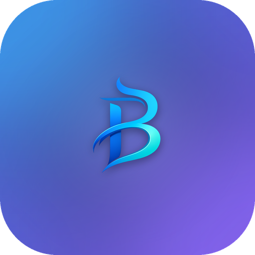

<div align="center">



# Bharga Mail

### Your inbox. Your keys. Made in Germany. 🇩🇪

**An AI‑native, privacy‑first email client.** Your mail, your credentials, and (optionally) your AI run **on your device** — never on our servers.

[](LICENSE)
[](#privacy--security)
&nbsp;·&nbsp; [Privacy](#privacy--security) · [Features](#features) · [Build](#build--run) · [Enterprise](COMMERCIAL.md)

</div>

---

## Why Bharga Mail

Most "AI email" lives in someone else's cloud — your messages and login tokens flow through their servers so the magic can happen. We do the opposite. Bharga Mail is a **local‑first desktop app**: it talks to your mail servers directly, keeps everything on your machine, and can run its AI **on‑device**. The code is **open and auditable**, because you shouldn't have to *trust* the app you hand your inbox to — you should be able to *verify* it.

## Privacy & security

- **Your mail never leaves your device.** Bharga Mail connects straight to your IMAP / Gmail / Microsoft 365 servers. There is no Bharga server in the middle.
- **Credentials in the OS keychain**, secrets sealed with AES‑256‑GCM. Mail is stored in a **local SQLite** database (full‑text search included) — on your disk, not ours.
- **Reading mail doesn't mark it read by accident.** We fetch with `BODY.PEEK[]`, so syncing never silently flips your messages to *seen* on the server.
- **AI is yours to choose.** Run triage/summaries fully **on‑device** (local model), or bring your own OpenAI/Anthropic key. Cloud AI is opt‑in, per‑role, and never required.
- **Sandboxed rendering.** Email HTML is sanitized and rendered in a locked‑down, script‑free iframe with a strict CSP. Links are screened and obvious phishing is flagged.
- **Made in Germany**, built around the privacy expectations that implies.

## Features

- 🧠 **AI triage, summaries & drafts** — bring your own key or run a local model; private by default.
- 🗂️ **Conversation accordion** — Apple‑Mail‑style threading: one row per conversation, a message‑count badge, expand inline (newest → oldest).
- 🛡️ **Trust & phishing shields** — per‑message SPF/DKIM/DMARC trust and AI‑assisted dangerous‑link detection.
- 📥 **Multi‑account** — IMAP, Gmail, and Microsoft 365 / Graph, with instant IMAP **IDLE** push.
- ✍️ **Modern compose** — from‑account picker, contact autocomplete, scheduled send, undo send, rich text, signatures.
- 🔎 **Fast local search** (SQLite FTS5), smart bundles, snooze, flags, and AI "smart chips".

## Tech

Tauri 2 (Rust core) · React 19 + TypeScript (Vite) · local SQLite + FTS5 · OS keychain. The app is **local‑first by design** — the desktop client *is* the product (a browser can't reach IMAP/SMTP without a server in the middle, which is exactly what we avoid).

## Build & run

**Prerequisites:** [Rust](https://rustup.rs) · [Bun](https://bun.sh) · platform toolchain (Xcode Command Line Tools on macOS).

```bash
git clone https://github.com/mpoonuru/bharga-mail.git
cd bharga-mail/app
bun install

# run in dev
bun run tauri:dev

# build a signed/installable bundle
bun run tauri:build
```

## License

Bharga Mail is **free and open source under the [GNU AGPL‑3.0](LICENSE)**. You can use, study, modify, and self‑host it — and if you run a modified version as a service, the AGPL asks you to share your changes.

> **Companies & public sector:** the AGPL works for many; if you need a commercial license (no copyleft obligations), support/SLA, SSO, central admin, or an on‑prem sync server, see **[COMMERCIAL.md](COMMERCIAL.md)**.

**"Bharga Mail" and the Bharga Mail logo are trademarks of the project author.** The AGPL covers the *code* — it does **not** grant rights to the name or brand. Forks are welcome; please ship them under a different name.

## Contributing

PRs welcome — see **[CONTRIBUTING.md](CONTRIBUTING.md)**. Contributions require signing the [Contributor License Agreement](CLA.md) (so the project can offer commercial licenses to fund development).

---

<div align="center"><sub>Made with care in Germany. Your data stays with you.</sub></div>
